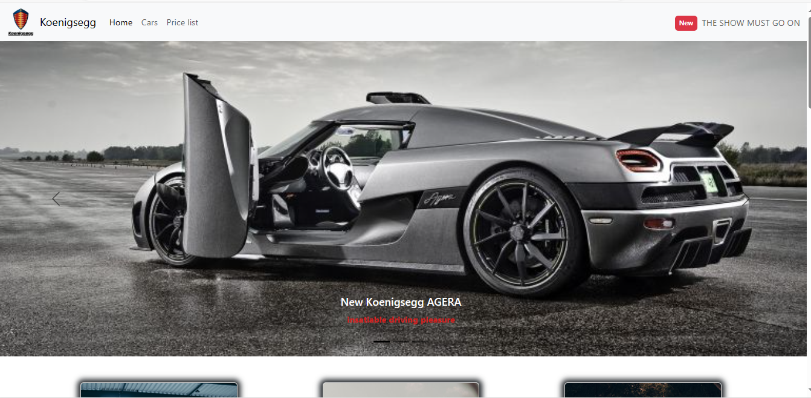

# Koenigsegg with BS

This project showcases the design of the Koenigsegg brand car's website using HTML and CSS with the Bootstrap (BS) framework.

## Preview

[Project Demo](https://ezgif.com/video-to-gif?url=https://example.com/source-video.mp4)



## Technologies

- HTML
- CSS
- Bootstrap (BS)

## Getting Started

Follow the steps below to run the project locally:

1. Clone the repository:
   ```bash
   git clone https://github.com/Celal08/koenigsegg-bootstrap
